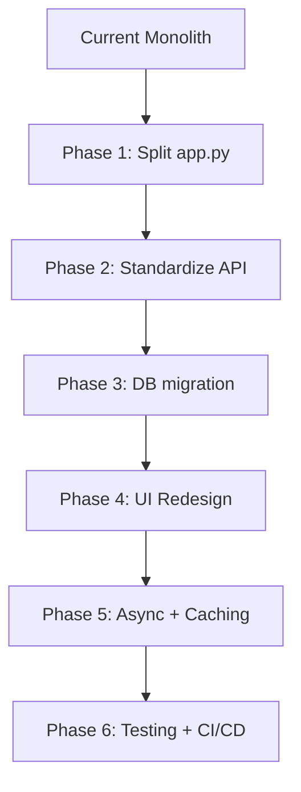

# KishanX Trading Signals — Enhancement Roadmap

## Project Overview

A production-ready auto-trading platform supporting Indian (NSE/BSE) and global/forex/OTC markets. Built with Flask + SocketIO backend, SQLite database, XGBoost AI signal predictor, Bootstrap 5 frontend with Chart.js, Angel One/Dhan broker integrations, Stripe/Razorpay payments, and multi-tier subscription model (Free/Premium/Pro/Enterprise).

**Key Stats**: ~5000-line `app.py` monolith, 30+ modules, 33 templates, 50+ API endpoints, 10+ database tables, 4 trading strategies, 2 payment gateways, 2 broker integrations.

---

## Critical Issues to Address

### 1. Monolithic `app.py` Bloat (~5000 lines)
- **Problem**: All routes, helpers, DB logic, and globals crammed into one file.
- **Fix**: Split into Flask Blueprints — `auth_routes.py`, `trading_routes.py`, `admin_routes.py`, `portfolio_routes.py`, `subscription_routes.py`, `settings_routes.py`.

### 2. Dual Database Confusion (`trading.db` vs `kishanx.db`)
- **Problem**: `trading.db` used by main app, `kishanx.db` by subscription/AI modules. Some modules use `branding.db_path` while others hardcode paths.
- **Fix**: Single database URL via config/env. Add migration scripts. Remove hardcoded paths.

### 3. SQLite for Production
- **Problem**: SQLite does not handle concurrent writes well. WebSocket + auto-trader + API causes `database is locked` errors.
- **Fix**: Migrate to PostgreSQL. Add connection pooling. Use WAL mode (already set) and retry logic.

### 4. No Centralized Error Handling
- **Problem**: Each route has its own try/except with duplicate logging patterns.
- **Fix**: Global error handler with structured JSON error responses. Dedicated error logging service.

### 5. Security Gaps
- **Problem**: 
  - No CSRF on most forms.
  - API keys logged in plain text.
  - Session fixation risk.
  - SQL injection via string concatenation in `reset_database()`.
- **Fix**: CSRF middleware, secret masking in logs, session regeneration on login, parameterized queries everywhere.

### 6. AI Model Missing Model File
- **Problem**: `signal_predictor_v2.pkl` may not be bundled. Auto-train on startup adds latency.
- **Fix**: Bundle a pre-trained model. Add async training with progress. Add model versioning in DB.

---

## UI/UX Enhancement Priorities

### 1. Dashboard Redesign (Highest Impact)
- Current: Cluttered single-page dashboard.
- Target: Modular widget grid — portfolio value, P&L, active trades, signals, charts.
- Framework: TradingView-inspired dark theme (already partially done with base.html).
- Add: Collapsible sidebar, resizable widgets, real-time ticker tape.

### 2. Mobile Responsiveness
- Current: Basic Bootstrap responsiveness; many tables break on mobile.
- Target: Mobile-first redesign. Touch-friendly order panel. Collapsible data tables.

### 3. Landing/Home Page
- Current: Redirects to login.html immediately.
- Target: Full marketing landing page with hero, features, pricing, FAQ, testimonials.

### 4. Charting
- Current: No advanced charting (uses basic Table/Chart.js).
- Target: Integrate TradingView's lightweight charts or Chart.js with candlestick + indicators.

### 5. Order Panel
- Current: Basic market/market order form.
- Target: Full order panel with limit/stop/stop-limit/bracket/OCO. Show margin impact, fees, risk estimate.

### 6. Onboarding & Tutorial
- Current: Tutorial overlay exists (`_tutorial_overlay.html`).
- Enhance: Guided walkthrough for new users. Demo-mode sandbox with reset button.

---

## Architecture Improvements

### 1. Module Reorganization
```
kishanx-trading/
├── app.py                  # Only WSGI entry + app factory
├── blueprints/
│   ├── auth/               # login, register, 2FA, profile
│   ├── trading/            # Indian, forex, OTC trading
│   ├── admin/              # admin panel
│   ├── portfolio/          # P&L, analytics
│   ├── subscription/       # plans, billing
│   └── api/                # REST endpoints
├── services/
│   ├── trading_engine.py   # Core trading logic
│   ├── market_data.py      # Price fetching + caching
│   ├── signal_generator.py # AI + rule-based signals
│   ├── order_executor.py   # Order placement
│   └── notification.py     # Alerts
├── models/                 # DB models (SQLAlchemy-ready)
├── core/
│   ├── config.py           # Central config
│   ├── security.py         # Auth, permissions
│   └── database.py         # Connection management
└── templates/              # Jinja2 templates
```

### 2. Database Schema Improvements
- Add `migrations/` folder with versioned schema changes.
- Add `idempotency_keys` table for payment idempotency.
- Add `audit_log` table with structured JSON payload.
- Index all foreign keys and common query columns.

### 3. API Standardization
- Current: Inconsistent response formats (`{status, message}`, `{success, error}`, raw JSON).
- Target: All APIs return `{success: bool, data: ..., error: ..., meta: {page, limit}}`.
- Add Swagger/OpenAPI docs.
- Add API versioning (`/api/v1/...`).

---

## Backend Enhancements

### 1. Async Processing
- Replace threading for auto-trader, notifications, backups with Celery or Redis Queue.
- WebSocket manager needs reconnection logic (currently fragile).

### 2. Caching
- Current: File-based JSON cache.
- Upgrade: Redis for market data cache + session store + rate limiter + pub/sub for WebSocket.

### 3. Rate Limiting
- Current: Custom per-service limiter.
- Upgrade: Token bucket algorithm with Redis backend. Per-user + per-IP limits.

### 4. WebSocket Resilience
- Auto-reconnect on disconnect.
- Last-price cache for reconnection.
- Heartbeat monitoring.

### 5. Testing
- Current: Zero test coverage.
- Add: `pytest` with fixtures. Unit tests for trading engine, risk manager, signal predictor. Integration tests for API endpoints. Load tests for WebSocket.

### 6. CI/CD
- GitHub Actions: lint (flake8/ruff), type-check (mypy), test (pytest), build Docker.

---

## Trading-Specific Enhancements

### 1. Strategy Engine
- Current: Hardcoded strategies (RSI, MACD, BB, MA).
- Target: Plugin-based strategy architecture. Users create custom strategies via config or code.

### 2. Backtesting
- Missing: No backtesting engine.
- Add: Historical data replay. Strategy performance simulation. Sharpe ratio, max drawdown, win rate reporting.

### 3. Risk Manager
- Current: Good foundation but all in-memory.
- Persist risk rules to DB. Add trailing stop-loss. Add time-based trade filters.

### 4. Multi-Broker Support
- Current: Angel One + Dhan.
- Add: Zerodha Kite, Upstox, Groww via pluggable broker adapter interface.

### 5. Options Trading
- Current: Basic Black-Scholes calculator, no real options trading.
- Add: NSE F&O data, options chain display, strategy builder (straddle/strangle/iron condor).

---

## AI/ML Enhancements

### 1. Model Pipeline
- Current: Single XGBoost model, auto-trained on startup.
- Target: Ensemble of models (XGBoost + LSTM + Transformer). Scheduled retraining. A/B testing between model versions.

### 2. Feature Store
- 100+ features: macro indicators, news sentiment, options flow, order book imbalance.

### 3. Explainability
- Current: Gemini explainer exists (`gemini_explainer.py`).
- Enhance: SHAP values for each prediction. Natural language explanation for every signal.

### 4. Anomaly Detection
- Detect unusual market moves. Alert on flash crashes. Flag suspicious order activity.

---

## Security Hardening

1. **2FA**: Already implemented (TOTP + recovery codes). Add backup codes download as PDF.
2. **API Keys**: Encrypt at rest. Mask in logs. Allow rotation from UI.
3. **Session**: Short-lived access tokens + long-lived refresh tokens. Device management.
4. **Audit**: Log all sensitive actions (login, trade, config change, permission grant).
5. **Compliance**: Add GDPR data export/deletion. Add trade journal export for tax filing.

---

## Operations & DevOps

1. **Docker Compose**: Multi-service (web + redis + celery + postgres).
2. **Monitoring**: Prometheus metrics (request latency, trade volume, error rate). Grafana dashboards.
3. **Logging**: Structured JSON logs. Centralized via ELK/Loki.
4. **Backups**: Already exists but needs encryption. Add S3/cloud storage sync.

---

## Quick Wins (1-2 days each)

1. **Split `app.py`** into 5+ blueprint files — immediate dev speed boost.
2. **Add Flask-Migrate (Alembic)** for schema versioning.
3. **Standardize API responses** with a `@json_response` decorator.
4. **Add `pytest` with 10 basic tests** for core trading logic.
5. **Fix all hardcoded DB paths** to use a single config.
6. **Add CSRF protection** to all POST forms.
7. **Replace `random` signal generation** with technical-indicator-based fallback (50% of `predict_symbol` code already exists).
8. **Add loading/skeleton states** to all templates.
9. **Mobile-responsive tables** — add horizontal scroll on all data tables.
10. **Cache static assets with version hash** (already partially done).

---

## Migration Strategy



No phase should break existing functionality. Each phase is independently deployable and reversible.
